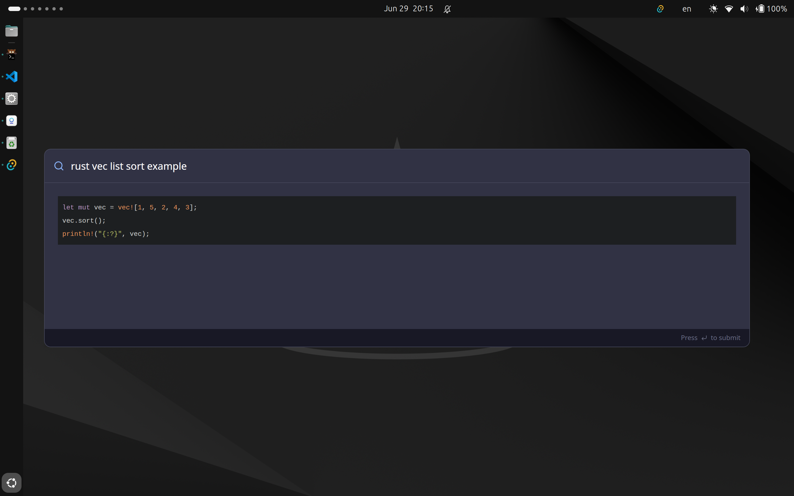

# kawAI

Get instant LLM answers from a cross-OS command palette (<kbd>Super+Shift+P</kbd>).





> [!WARNING]  
> This project works but I just spent a few hours on it so I don't provide bundles yet.

## Build from source

### Pre-requisites

- Node.js & Yarn v4+
- Rust
- [Tauri pre-requisites for your OS](https://v2.tauri.app/start/prerequisites/)

### Build

```
git clone https://github.com/ivangabriele/kawai.git
cd kawai
yarn
```

Then running `yarn tauri build` or `yarn tauri build && yarn tauri bundle`
should automatically build bundles as well as a standalone executuable for your OS.

### Run

1. Install the bundle if you're using one.
2. Create a `.kawairc` at the root of your home directory with the following content:
  ```
  API_KEY=your_gemini_api_key
  ```
3. You're ready to run kawAI!

- Use <kbd>Super+Shift+P</kbd> to open the command palette and start typing your query.
- Press <kbd>Esc</kbd> to close the command palette.

---

```txt
(\___/) | > Who are you?
(=^.^=) |
(")_(") | I'm kawAI 🐰, a GUI chatbot giving answers before you're even done typing.
```
